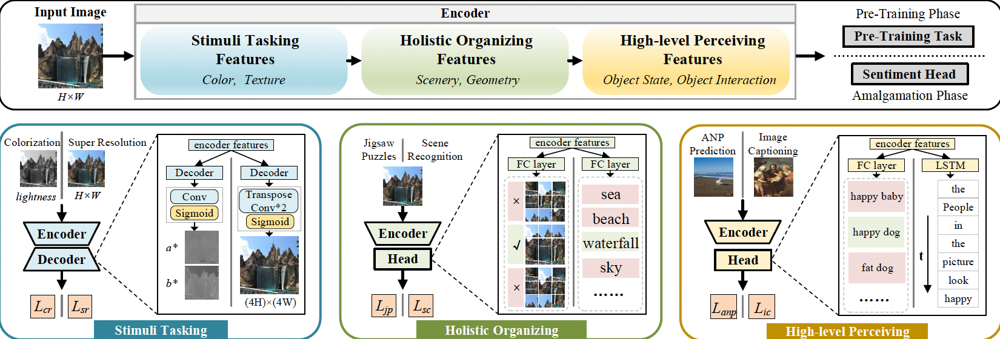

# *Probing Sentiment-Oriented Pre-Training Inspired by Human Sentiment Perception Mechanism*
The official code and dataset of our paper:

*Probing Sentiment-Oriented Pre-Training Inspired by Human Sentiment Perception Mechanism*
<br/>
<br/>


# Abstract
Pre-training of deep convolutional neural networks (DCNNs) plays a crucial role in the field of visual sentiment analysis (VSA). Most proposed methods employ the off-the-shelf backbones pre-trained on large-scale object classification datasets (i.e., ImageNet). While it boosts performance for a big margin against initializing model states from random, we argue that DCNNs simply pre-trained on ImageNet may excessively focus on recognizing objects, but failed to provide high-level concepts in terms of sentiment. To address this long-term overlooked problem, we propose a sentiment-oriented pre-training method that is built upon human visual sentiment perception (VSP) mechanism. Specifically, we factorize the process of VSP into three steps, namely stimuli taking, holistic organizing, and high-level perceiving. From imitating each VSP step, a total of three models are separately pre-trained via our devised sentiment-aware tasks that contribute to excavating sentiment-discriminated representations. Moreover, along with our elaborated multi-model amalgamation strategy, the prior knowledge learned from each perception step can be effectively transferred into a single target model, yielding substantial performance gains. Finally, we verify the superiorities of our proposed method over extensive experiments, covering mainstream VSA tasks from single-label learning (SLL), multi-label learning (MLL), to label distribution learning (LDL). Experiment results demonstrate that our proposed method leads to unanimous improvements in these downstream tasks.
<p align="center">
  
</p>
<br/>

# Code Instructions
This repository contains our official implementation code for paper: ***Probing Sentiment-Oriented Pre-Training Inspired by Human Sentiment Perception Mechanism***

For sentiment-oriented pre-training, you can first modify the config file to accommodate your environment and then run:
```
cd pre-training
bash pre-training.sh
```

For knowledge amalgamation, please go for:
```
cd amalgamation
python main.py
```

Evaluation realists will be printed on the terminal.

# Reference
If you find this repo useful, please cite the following publication:
```
@inproceedings{feng2023probing,
  title={Probing Sentiment-Oriented Pre-Training Inspired by Human Sentiment Perception Mechanism},
  author={Tinglei, Feng and Jiaxuan, Liu and Jufeng, Yang},
  booktitle={Proceedings of the IEEE/CVF Conference on Computer Vision and Pattern Recognition},
  year={2023}
}
```

